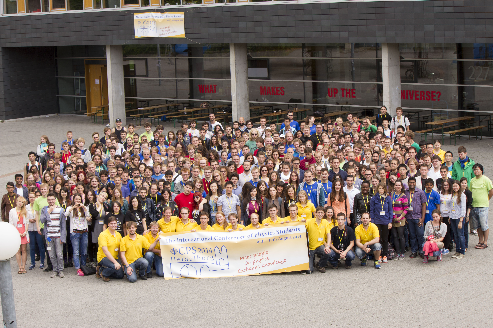

<header id="header" class="skel-layers-fixed">

# [ICPS 2016 Malta](index.html)

<nav id="nav">

*   [Home](index.html)
    *   [Location](location/index.html)
        *   [Arrival](location/arrival.html)
        *   [Accommodation](location/accommodation.html)
        *   [The islands](location/malta.html)
        *   [University of Malta](location/uom.html)
    *   [Program](program/index.html)
        *   [Guest Lectures](program/guests.html)
        *   [Student Lectures](program/students.html)
        *   [Workshops](program/workshops.html)
        *   [Excursions](program/excursions.html)
        *   [Social Events](program/events.html)
        *   [AGM](program/agm.html)
        *   [IAPS Workshops](program/iaps.html)
    *   [Organisers](organisers.html)
    *   [FAQ](faq.html)
    *   [Contact](contact.html)
*   [ICPS](icps.html)
*   [IAPS](iaps.html)
*   [Supporters](supporters.html)
*   [Registration](registration.html)

</nav>

</header>

<article id="main">

<section class="wrapper style1 container">

<section>

<header>

## What is ICPS?

</header>

The International Conference of Physics Students is organized every year by a member society of IAPS. Since the first conference in Hungary in 1986 the conference has increased continuosly in size and number of activities offered for the participants. The conference is entirely organised by physics students for physics students.

At the ICPS you can meet physics students from all around the world, talk about science and life and present your research results to an international audience. The conference includes lectures by invited speakers, contributed talks by students, poster sessions, scientific and cultural excursions and many other events where you can get to know more people who are enthusiastic about physics and learn about science as well as other cultures.

Every member society of IAPS can bid for hosting the ICPS in the following year. The annual general meeting of IAPS will then decide on the organizer. If you want to make a bid for ICPS 2016 you can contact the executive committee of IAPS: ec(at)iaps.info.

If you want to participate in the ICPS you have to become a member of IAPS.

</section>

</section>

<section class="wrapper style1 container special">

<table class="contenttable">

<thead>

<tr>

<th scope="col">**Year  
**</th>

<th scope="col">Location</th>

</tr>

</thead>

<tbody>

<tr>

<td>**1986**</td>

<td>Budapest, Hungary</td>

</tr>

<tr>

<td>**1987**</td>

<td>Debrecen, Hungary</td>

</tr>

<tr>

<td>**1988**</td>

<td>Prague, Czechoslovakia</td>

</tr>

<tr>

<td>**1989**</td>

<td>Freiburg, Germany</td>

</tr>

<tr>

<td>**1990**</td>

<td>Amsterdam, The Netherlands</td>

</tr>

<tr>

<td>**1991**</td>

<td>Vienna, Austria</td>

</tr>

<tr>

<td>**1992**</td>

<td>Lisbon, Portugal</td>

</tr>

<tr>

<td>**1993**</td>

<td>Bodrum, Turkey</td>

</tr>

<tr>

<td>**1994**</td>

<td>St. Petersburg, Russia</td>

</tr>

<tr>

<td>**1995**</td>

<td>Copenhagen, Denmark</td>

</tr>

<tr>

<td>**1996**</td>

<td>Szeged, Hungary</td>

</tr>

<tr>

<td>**1997**</td>

<td>Vienna, Austria</td>

</tr>

<tr>

<td>**1998**</td>

<td>Coimbra, Portugal</td>

</tr>

<tr>

<td>**1999**</td>

<td>Helsinki, Finland</td>

</tr>

<tr>

<td>**2000**</td>

<td>Zadar, Croatia</td>

</tr>

<tr>

<td>**2001**</td>

<td>Dublin, Ireland</td>

</tr>

<tr>

<td>**2002**</td>

<td>Budapest, Hungary</td>

</tr>

<tr>

<td>**2003**</td>

<td>Odense, Denmark</td>

</tr>

<tr>

<td>**2004**</td>

<td>Novi Sad, Serbia and Montenegro</td>

</tr>

<tr>

<td>**2005**</td>

<td>Coimbra, Portugal</td>

</tr>

<tr>

<td>**2006**</td>

<td>Bucarest, Romania</td>

</tr>

<tr>

<td>**2007**</td>

<td>London, United Kingdom</td>

</tr>

<tr>

<td>**2008**</td>

<td>Kraków, Poland</td>

</tr>

<tr>

<td>**2009**</td>

<td>Split, Croatia</td>

</tr>

<tr>

<td>**2010**</td>

<td>Graz, Austria</td>

</tr>

<tr>

<td>**2011**</td>

<td>Budapest, Hungary</td>

</tr>

<tr>

<td>**2012**</td>

<td>Utrecht, The Netherlands</td>

</tr>

<tr>

<td>**2013**</td>

<td>Edinburgh, United Kingdom</td>

</tr>

<tr>

<td>**2014**</td>

<td>Heidelberg, Germany</td>

</tr>

<tr>

<td>**2015**</td>

<td>Zagreb, Croatia</td>

</tr>

</tbody>

</table>

</section>

</article>

<footer id="footer">

*   [Twitter](https://twitter.com/icps2016)
*   [Facebook](https://facebook.com/icps2016)

*   © ICPS 2016
*   Design: [Norbert Bonnici](http://norbert.bonnici.co)

</footer>