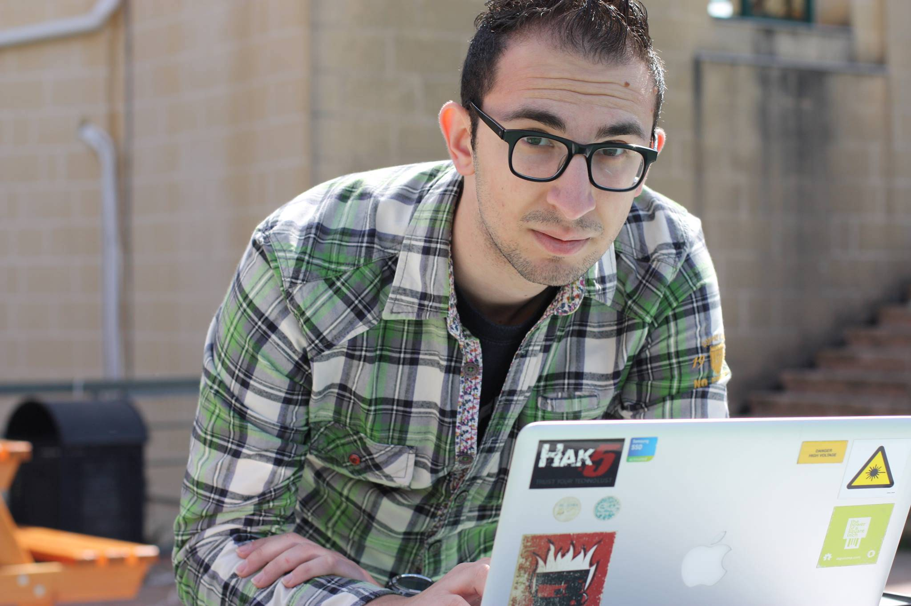
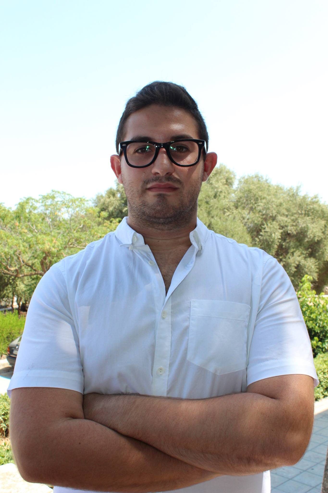
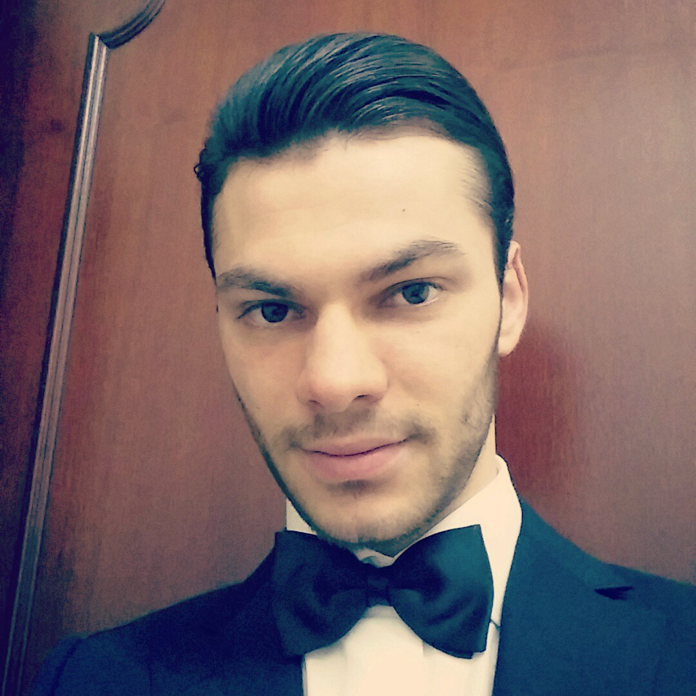
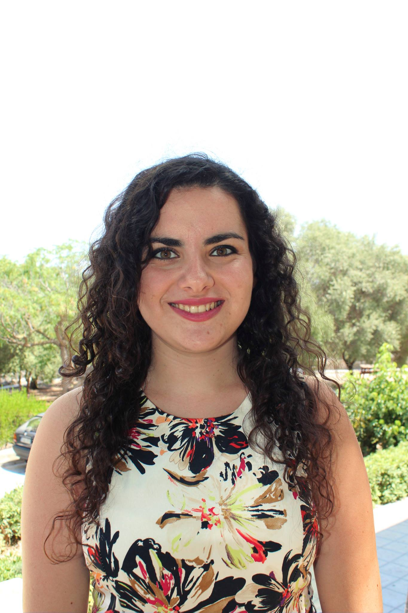
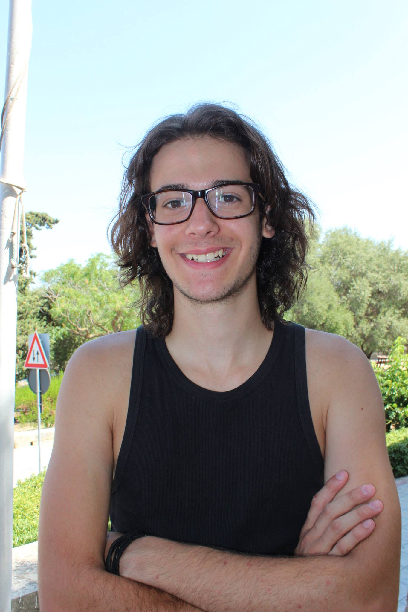
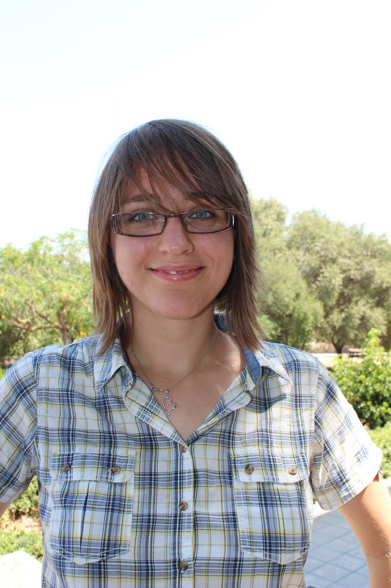
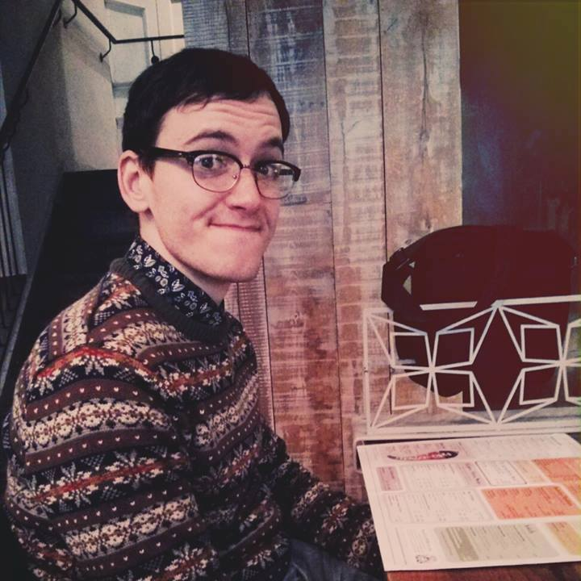
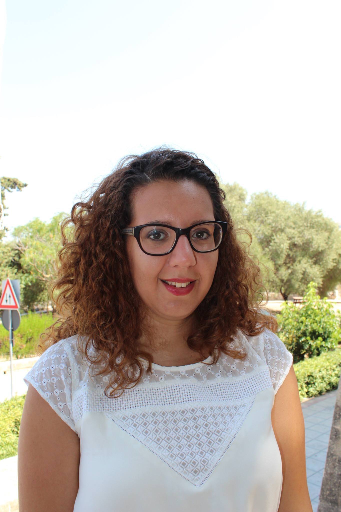
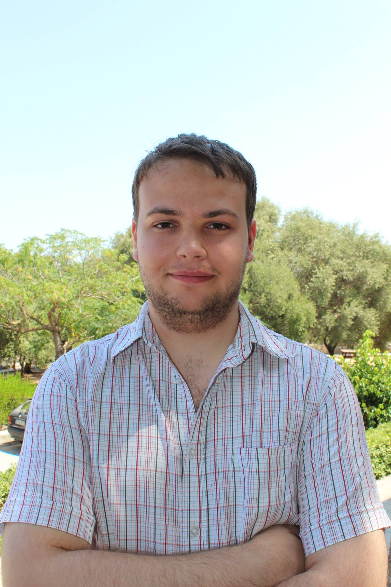
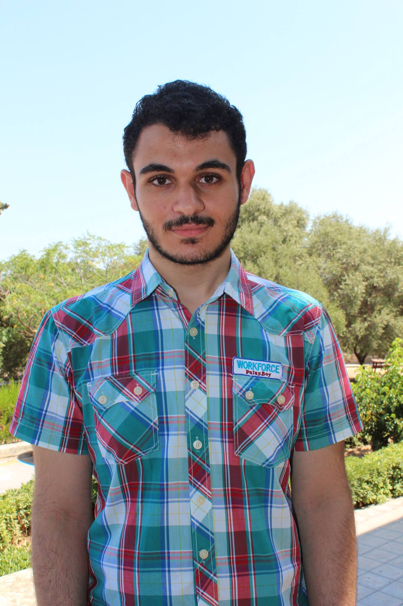

<header id="header" class="skel-layers-fixed">

# [ICPS 2016 Malta](index.html)

<nav id="nav">

*   [Home](index.html)
    *   [Location](location/index.html)
        *   [Arrival](location/arrival.html)
        *   [Accommodation](location/accommodation.html)
        *   [The islands](location/malta.html)
        *   [University of Malta](location/uom.html)
    *   [Program](program/index.html)
        *   [Guest Lectures](program/guests.html)
        *   [Student Lectures](program/students.html)
        *   [Workshops](program/workshops.html)
        *   [Excursions](program/excursions.html)
        *   [Social Events](program/events.html)
        *   [AGM](program/agm.html)
        *   [IAPS Workshops](program/iaps.html)
    *   [Organisers](organisers.html)
    *   [FAQ](faq.html)
    *   [Contact](contact.html)
*   [ICPS](icps.html)
*   [IAPS](iaps.html)
*   [Supporters](supporters.html)
*   [Registration](registration.html)

</nav>

</header>

<article id="main">

<section class="wrapper style1 container special">

<header>

## The team

</header>

<section>

<header>

### Norbert Bonnici

#### President

A soon to be master of physics with expertise in High Performance Computing using embedded electronics such as Field Programmable Gate Arrays. Currently contributing to the Low Frequency Aperture Array (LFAA) of the Square Kilometre Array (SKA) and following a traineeship at the European Space Agency (ESA).

</header>

</section>

<section>

<header>

### Nicholai Cumbo

#### Vice President

In his final year of a bachelors degree in mathematics and physics. He would like to continue studying plasma physics in the years to come, specialising in controlled nuclear fusion. Other than the stereotype geeky hobbies, he spends most of his free time trying to raise awareness about science subjects at university level and beyond.

</header>

</section>

<section>

<header>

### Kevin Psaila

#### Treasurer

Currently a fourth year student reading for a degree in physics and mathematics. His preferred field is cosmology and he is currently doing his dissertation on alternate theories of gravity. Other interests include football and swimming. Going out with his friends and have a couple of beers is his preferred night and anyone reading this is welcome to join!

</header>

</section>

</section>

<section class="wrapper style1 container special">

<section>

<header>

### Anita Farrugia

#### Logistics Coordinator

Sed tristique purus vitae volutpat commodo suscipit amet sed nibh. Proin a ullamcorper sed blandit. Sed tristique purus vitae volutpat commodo suscipit ullamcorper sed blandit lorem ipsum dolore.

</header>

</section>

<section>

<header>

### Jacob Spiteri

#### Communications Coordinator

Sed tristique purus vitae volutpat commodo suscipit amet sed nibh. Proin a ullamcorper sed blandit. Sed tristique purus vitae volutpat commodo suscipit ullamcorper sed blandit lorem ipsum dolore.

</header>

</section>

<section>

<header>

### Daphne Pollacco

#### Secretary

Currently a fourth year student studying for a B.Sc. maths and physics, she is interested in furthering her studies in medical physics. Her hobbies include playing the flute, photography, drawing and travelling around Europe.

</header>

</section>

</section>

<section class="wrapper style1 container special">

<section>

<header>

### Julian Bonello

#### Sponsors Coordinator

Sed tristique purus vitae volutpat commodo suscipit amet sed nibh. Proin a ullamcorper sed blandit. Sed tristique purus vitae volutpat commodo suscipit ullamcorper sed blandit lorem ipsum dolore.

</header>

</section>

<section>

<header>

### Dale Scerri

#### Creative Physicist

A 2015 physics and mathematics graduate, Dale is currently pursuing a PhD in quantum technologies. He is responsible for the ICPS 2016 logo and helped with the overall layout of the poster. In his free time, Dale can be found doodling and pretending to be an artist. Such doodles can be found [here](http://mathonaut.tumblr.com).

</header>

</section>

<section>

<header>

### Antonella Cutajar

#### Housing coordinator

A fourth year mathematics and physics student, Antonella is currently developing an Atmospheric Dispersion model as her final year project. Her main interests include Air Quality and Climate Change and she hopes to pursue her studies in these areas. Spends her free time baking and her dream is to travel the world.

</header>

</section>

</section>

<section class="wrapper style1 container special">

<section>

<header>

### Andrew Finch

#### Scientific Events

A fourth year physics and mathematics student, Andrew is currently working on his dissertation which treats alternate theories for the expansion of the universe. Other interests include particle accelerators, ion engines and wormholes. Hobbies include swimming, playing the guitar and walks in the countryside.

</header>

</section>

<section>

<header>

### Gabriel Falzon

#### Activities

Sed tristique purus vitae volutpat commodo suscipit amet sed nibh. Proin a ullamcorper sed blandit. Sed tristique purus vitae volutpat commodo suscipit ullamcorper sed blandit lorem ipsum dolore.

</header>

</section>

<section>

<header>

### Julia Vella

#### Social Events

A third year science student reading for a B.Sc. (Hons) in Mathematics and Physics. With a keen interest in Astronomy and Cosmology, she hopes to continue her research in Computational Astrophysics. She enjoys writing nonsensical stories for pleasure, and loves all kinds of sports.

</header>

</section>

</section>

<section class="wrapper style1 container special">

<section>

<header>

### Stefan Chircop

#### IT Coordinator

A fresh undergraduate pursuing Physics and Mathematics, Stefan hopes to further his studies, focusing mainly on Mathematics. Holds the irrational belief that soup has all the answers.

</header>

</section>

<section>

<header></header>

</section>

<section>

<header></header>

</section>

</section>

</article>

<footer id="footer">

*   [Twitter](https://twitter.com/icps2016)
*   [Facebook](https://facebook.com/icps2016)

*   © ICPS 2016
*   Design: [Norbert Bonnici](http://norbert.bonnici.co)

</footer>